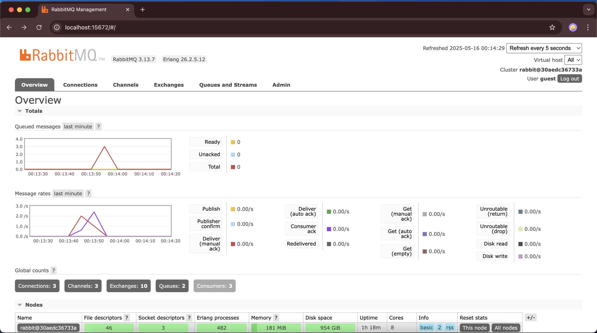
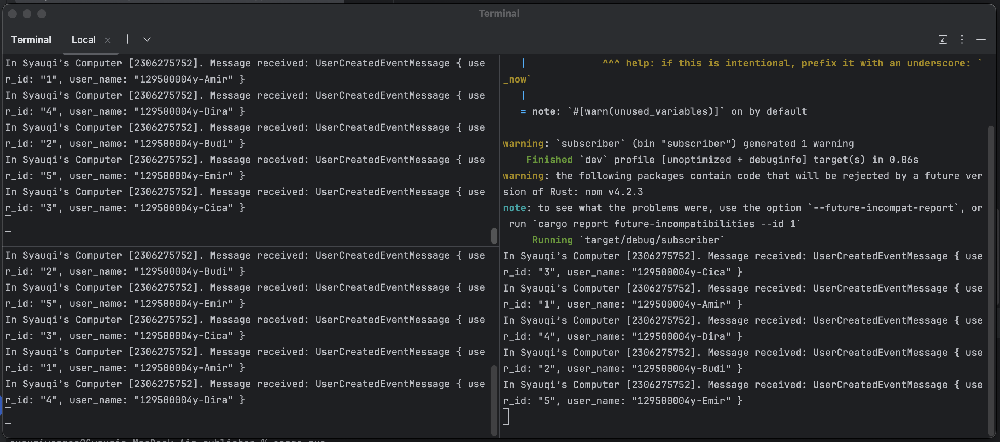

# Reflection
## Subscriber

a. What is amqp? \
AMQP (Advanced Message Queuing Protocol) adalah protokol komunikasi yang memungkinkan aplikasi saling bertukar pesan secara aman dan terpisah lewat queue, tanpa harus aktif bersamaan. Umumnya digunakan di sistem microservices untuk mengirim dan menerima pesan secara asinkron melalui message broker seperti RabbitMQ. Dengan AMQP, pengirim (publisher) mengirim pesan ke broker, lalu penerima (subscriber) mengambilnya dari queue, sehingga proses lebih terstruktur, handal, dan tidak saling bergantung secara langsung.

b. What does it mean? guest:guest@localhost:5672 , what is the first guest, and what
is the second guest, and what is localhost:5672 is for? git\
guest:guest@localhost:5672 adalah format koneksi ke RabbitMQ, di mana guest pertama adalah username, guest kedua adalah password, localhost menunjukkan server RabbitMQ berjalan di komputer lokal, dan 5672 adalah port standar yang digunakan oleh protokol AMQP. Artinya, aplikasi akan mencoba terhubung ke RabbitMQ di komputer sendiri menggunakan akun default guest.

### Simulation Slow Subscriber

Pada komputer saya terdapat sampai 11 queue. Saya menjakankan publisher sebanyak 3 kali secara cepat. Kecepatan pengiriman tidak sebanding dengan kecepatan penerimaan, sehingga membuat pesan tersimpan ke dalam queue terlebih dahulu sebelum diterima oleh subscriber.

### Multi Simulation Slow Subscriber

Dengan jumlah message yang sama dari publisher, dengan memiliki banyak subscriber, panjang queue tidak sepanjang sebelumnya, hal ini karena message dikomsunsi merata oleh ketiga subscriber. Namun, subscriber jadi tidak menerima keseluruhan message. Yang menjadi masalah di sini adalah ketika kita ingin semua subscriber sama sama menerima pesan yang sama.